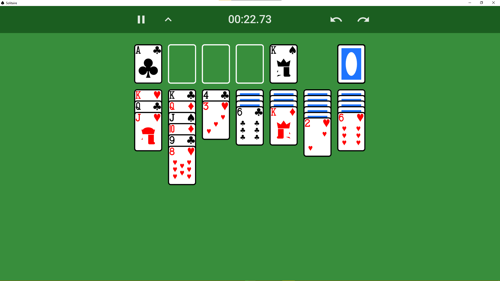

# Projeto Solitário

## FPRO/MIEIC, 2020/21

## João António Semedo Pereira (up202007145)

## 1MIEIC01

### Objetivo

Criar uma versão do clássico solitário Klondike (e talvez outras variações)

### Descrição

É um jogo de cartas para um jogador em que o objetivo é mover todas as cartas do mesmo naipe para a mesma pilha. Estes movimentos têm certas regras, como as cartas terem que estar empilhadas por ordem e com as cores a alternar.

### UI

### Pacotes

- [Pygame](https://www.pygame.org)
- [pynanosvg](https://github.com/ethanhs/pynanosvg)

### Tarefas

- [x] Cartas
- [x] Pilhas de cartas
- [x] Interação com o rato
- [x] Verificar vitória
- [x] Interface gráfica

Atualizado a última vez em 24/01/2021
